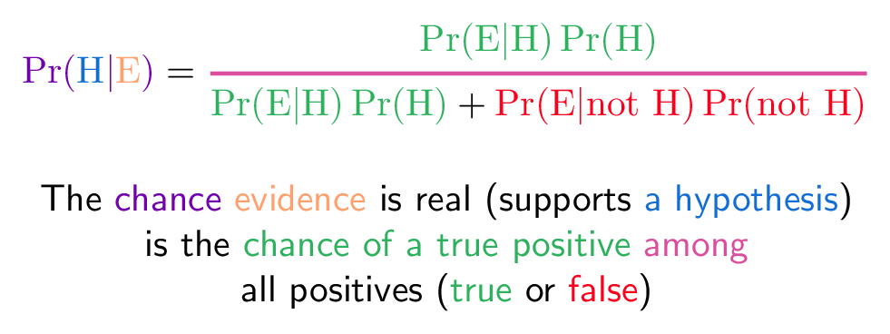
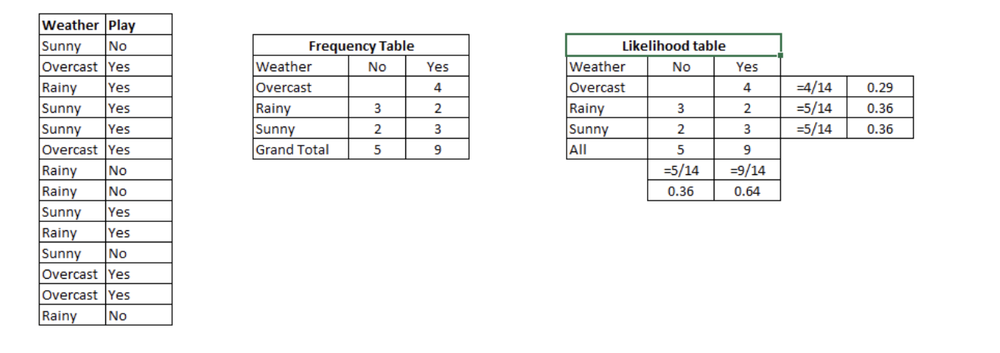

## 
朴素贝叶斯

### 介绍

朴素贝叶斯是一种基于贝叶斯公式**分类机制**，且假设预测特征之间是独立的（independence among predictors）。简单来说， 简单贝叶斯分类器假设一类中的特定特征与其他特征无关，他们独立贡献自己的概率。这也是称它**Navie**的原因。

贝叶斯公式如下：
$$
\operatorname{Pr}(\mathrm{H} | \mathrm{E})=\frac{\operatorname{Pr}(\mathrm{E} | \mathrm{H}) \operatorname{Pr}(\mathrm{H})}{\operatorname{Pr}(\mathrm{E})}
$$
可以写作下面的形式：

- Pr(H|E) = 通过发生的case判断H为true的概率。
- Pr(E|H) = H为true时候case发生的概率。
- Pr(H) = H为true的概率
- Pr(not H) = H为false的概率
- Pr(E|not H) = H为false时候case发生的概率。

### 工作原理

使用一个例子来阐述工作原理，下图表示训练数据，表示天气状况和是否“play”的概率。要预测的结果是根据天气的状况来预测是否“play”。分为以下几个步骤：

1. 将数据集做成频率表的形式
2. 将频率表再做成likelyhood table的形式
3. 使用贝叶斯公式计算每个类别的后验概率。最大的概率即为结果。

### 提高Navie Bayes的一些技巧

- 若连续特征不服从正态分布，应做一些转换使其服从正态分布。
- 若在测试数据集中出现了训练数据集中没有的特征，使用平滑的方式来避免（zero frequency）
- 去掉相关性较强的特征，如果不去掉等同于一个特征进行了两次投票。
- 朴素贝叶斯参数调优的作用有限，重点放在数据预处理和特征选择上。
- ensembling, bagging and boosting 的机制对于朴素贝叶斯来说并没有太大的帮助，因为他们的目的是减小**variance**，但是朴素贝叶斯没有variance可以来减小。

### 参考

[1.一文详解朴素贝叶斯原理](https://zhuanlan.zhihu.com/p/37575364)

[2.Naive Bayes Algorithm ](https://www.analyticsvidhya.com/blog/2017/09/naive-bayes-explained/)

