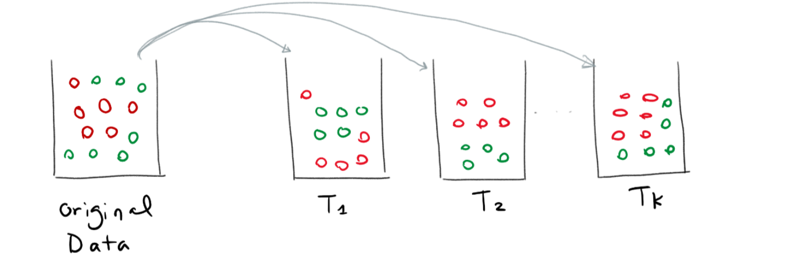

## 
决策树及集成学习

### 信息熵

- 如何表示信息量$H(X)$

  一件事情的信息量是和这件事情发生的概率相关的，根据常识，一般越难发生的事情信息量越大，因此信息量可能和概率的倒数成一个正相关的关系。

- 信息量之间如何运算

  两件事情（假设独立）的信息量应该是和的关系。即$H(X,Y)=H(X)+H(Y)$。

- 信息量的范围

  最多会觉得这件事情没有信息，但是不可能为负的。因此有$H(X)\ge0$

  故最后信息量使用了概率的对数来表示，即$H(X)=\log{\frac{1}{p(X)}}$

  最后信息熵是信息量的均值$Entropy(X)=E_X[H(X)]=-\sum_xp(x)\log p(x)$

### 常见算法

- 信息增益（对应ID3）

  假设原始数据集为S，使用a属性作为分裂属性。
  $$
  Gain(S,a)=Entropy(S)-\sum\frac{|S_v|}{|S|}Entropy(S_v)
  $$

- 信息增益率（对应C4.5）

  

- Gini Index（对应CART）

  对于给定的节点t，Gini Index的计算公式如下：
  $$
  GINI(t) = 1-\sum_j[p(j|t)]^2
  $$
  其中$p(j|t)$表示在节点t上每个类型出现的频率。Gini index具体计算如下：

  |  C1  |   0   |
  | :--: | :---: |
  |  C2  |   6   |
  | Gini | 0.000 |

  计算过程：
  $$
  p(c1|t)=0 \\
  p(c2|t)=1\\
  1-1^2-0^2=0
  $$

  |  C1  |   1   |
  | :--: | :---: |
  |  C2  |   5   |
  | Gini | 0.278 |

  计算过程：
  $$
  p(c1|t)=\frac{1}{6}\\
  p(c2|t)=\frac{2}{6}\\
  1-{\frac{1}{6}}^2-{\frac{5}{6}}^2=0.278
  $$
  因此用Gini Index如何引导决策树？引出了Gini split，Gini split的定义如下：
  $$
  GINI_{split}=\sum_{i=1}^{k}\frac{n_i}{n}GINI(i)
  $$
  对于原始数据分为了K个分支，对于每个部分求出对应的GINI index，求出加权和。Gini index也叫Gini不纯度，因为从上面的计算公式中可以知道，当最不纯的时候为0.5，最纯的时候为0。因此$GINI_{split}$越小越好。

### 过拟合问题

- 剪枝
  - 预剪枝（边生长边修剪）
    - 最简单的方法是决策树在到达一定高度后就停止生长。
    - 到达此节点的实例个数小于某一个阈值也可以停止生长。
    - 到达此节点的实例具有相同的特征向量，而不必一定属于同一类，也可停止生长。这种情况可以处理数据中的数据 冲突问题;
    - 计算每次生长对系统性能的增益，如果这个增益值小于某 个阈值则不进行生长。
  - 后剪枝（生长完毕后修剪）
- 更多决策树应用的场景类别

  - 多分类

  - 回归（CART树）

    当目标变量是离散的情况下，做分类，此时是分类树。当目标变量是连续值的时候，此时做的是回归，此时的树为回归树。先找到一个最好的分割空间（特征），然后找到最好的分割点。

### Ensemble

- Bagging（Bootstrap Aggregating，很容易写并行的程序）

  Bootstrap是一种有放回的采样方式，来生成K组训练数据。如下图：

  

  

  Boostrap的中心思想是在有放回采样中，噪音被采样的概率很小。因此噪音数据就不会被训练到。对于每组数据，可以训练一个模型。最后通过投票的方式来产生预测结果。

  - Random Forest（Bagging with CARTs）

- Boosting（串行的程序）
  
  对于Bagging，一个明显的特点是多个弱学习器分别训练，不能将已经学习到的知识或发现的错误传递下去，因此Boosting可以看作是对Bagging的一种改进，Boosting是通过迭代地训练一系列的分类器，每个分类器采用的样本分布都和上一轮的学习结果有关。其代表算法是AdaBoost, GBDT。一般的Boosting的过程为：
  
  - 给定训练数据$D={(x^{(1)},y^{(1)}),\cdots,x^{(n)},y^{(n)}},x^{(1)}\in R^n,y^{(i)}\in{-1,1}$。对于每一个$x^{(i)}$都有一个与之对应的权重$w^{(i)}\in R$。
  
  - 首先对权重进行初始化，初始化的方法有很多，如取均值、随机初始化等方法。这里采用取均值的方法，即$W=(w^{(1)},w^{(2)},\cdots,w^{(n)})$，其中$w^{(i)}=\frac{1}{N}$。
  
  - 接着是弱学习器（以分类为例）的权重计算方法，假设$G_k(X)$是一个弱分类器，，则该弱分类器的error为$e_k=P(G_k(x^{(i)})\neq y^(i))=\sum w^{(i)}I(x^{(i)})\neq y^{(i)})$，其中$I(X)$是Indictor function，即$I(true)=1,I(false)=0$。而$w^{(i)}$为该样本对应的权重。则该分类器对应的权重更新公式为$\alpha_{k}=\frac{1}{2} \ln \left(\frac{1-e_{k}}{e_{k}}\right)$
  
  - 接着是对样本的更新，刚刚说到Boosting相比较于Bagging来说注重对发现的错误继承下去，因此会在下一次分类器迭代是给错误样本更大的均值，也就是增加错误样本的权重，减小正确样本的权重。因此样本权重的更新公式为：$w_{k+1}^{(i)}=\frac{w_{k}^{(i)}}{z_{k}} \exp \left(-\alpha_{k} y^{(i)} G_{k}\left(x^{(i)}\right)\right)$，对于以上公式有：
    $$
    \begin{array}{ll}{\text { if } y^{(i)}=G_{i k}\left(x^{(i)}\right)} & {w_{k}^{(i)} \cdot \frac{1}{e^{\alpha_{k}}}} \\ {\text { if } y^{(i)} \neq G_{\pi_{k}}\left(x^{(i)}\right)} & {w_{k}^{(i)} \cdot e^{\alpha_{k}}}\end{array}
    $$
    因此实现了上面说的增加错误样本权重，减小正确样本权重的说法，其中的$z_k$是一个normalization factor，$z_{k}=\sum_{i=1}^{N} \omega_{k}^{(i)} \exp \left(-\alpha_{k} G_{k}\left(x^{(i)}\right)\right)$。因为$z_k$，$w_k$可以看作是一个数据重要程度的分布。
  
  - 最后得到的分类器是各个迭代过程的分类器加权和：
    $$
    \begin{array}{l}{f(x)=\sum_{k=1}^{k} \alpha_{k} G_{k}\left(x^{(i)}\right)} \\ {G\left(x^{(i)}\right)=sign\left(f\left(x^{(i)}\right)\right.}\end{array}
    $$
    因此Boosting不是说最后的一个分类器是最好的，而是最后得到的结果是各个分类器的加权和，因此效果比较好。
  
  常见的Boosting算法有：
  
  - AdaBoost (**Ada**ptive **Boost**ing)
  
    上面介绍的就是AdaBoost的主要思想
  
  - GBDT（Gradient Boosting Decision Tree）
  
    AdaBoost算法通过给已有模型预测错误的样本更高的权重，使得先前的学习器做错的训练样本在后续受到更多的关注的方式来弥补已有模型的不足。与AdaBoost算法不同，梯度提升方法在迭代的每一步构建一个能够沿着梯度最陡的方向降低损失（steepest-descent）的学习器来弥补已有模型的不足。而且AdaBoost算法对异常点（outlier）比较敏感，而梯度提升算法通过引入bagging思想、加入正则项等方法能够有效地抵御训练数据中的噪音，具有更好的健壮性。
  
    GDBT可以用来做分类也可以用来做回归，对于回归来说，首先将变量的均值作为结果，然后对残差当作输出训练下一个迭代中的树，不断循环此过程直到训练结束，为防止过拟合.
  
  - XGBoost

### 参考

[regression tree](https://www.youtube.com/watch?v=g9c66TUylZ4)

[GBDT](https://www.zybuluo.com/yxd/note/611571)

[GBDT](https://www.youtube.com/watch?v=3CC4N4z3GJc&t=2s)

[GBDT](http://www.ccs.neu.edu/home/vip/teach/MLcourse/4_boosting/slides/gradient_boosting.pdf)

[GBDT](https://explained.ai/gradient-boosting/index.html)

