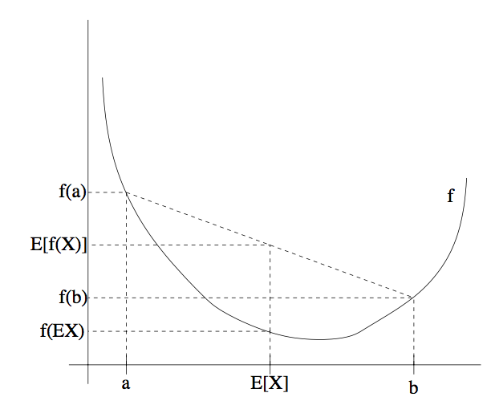
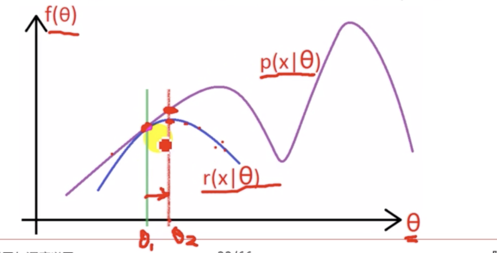

## 
EM算法

### Jensen不等式

#### 定义

设$f$为一个函数，其定义域（domain）为整个实数域（set of real numbers），可以用如下方式来表述 Jensen 不等式：

**定理（Theorem）：** 设 $f$ 是一个凸函数，且设 $X$ 是一个随机变量（random variable）。然后则有：
$$
E[f(X)] \geq f(E X)
$$
即：`函数的期望值大于期望的函数值`。可以类比$E(X^2) \ge [E(X)]^2$ 记忆。此外，如果函数 $f$是严格凸函数，那么 $E[f(X)] = f(EX)$当且仅当 $X = E[X]$的概率（probability）为1时成立（例如$X$ 是一个常数）。

**注1**：如果函数 $f$ 的二阶导数$ f(x) \ge 0$（其中的$ x \in R$），则函数 $f$ 为一个凸函数（convex function）。如果输入的为向量变量，那么这个函数就泛化了，这时候该函数的海森矩阵（hessian）H 就是一个半正定矩阵（positive semi-definite $H \ge 0$）。如果对于所有的$x$ ，都有二阶导数 $f''(x)>0$，那么我们称这个函数 $f$  是严格凸函数。（对应向量值作为变量的情况，对应的条件就是海森矩阵必须为正定，写作 $H>0$）。

**注2:** Jensen 不等式也适用于凹函数（concave）$f$，但不等式的方向要反过来，也就是对于凹函数，$E[f(X)] \le f(EX)$。

#### 理解

如上图所示，假设$f$ 为如上图所示的凸函数，$X$ 为一随机变量，$X$ 有0.5的几率取值为a，0.5的几率取值为b，故$E[X]$即为a、b的中点位置。而 $E[f(X)]$ 则位于$f(a)$和$f(b)$的重点位置。从图中可以很明显看出定理所得的公式。

### EM算法

#### 介绍

假设有一个估计问题，其中训练样本集包含了$\left\{x^{(1)}, \ldots, x^{(m)}\right\}$ 共m个独立样本。我们使用模型$p(x,z)$对其进行建模，其中的似然函数为：
$$
\begin{aligned} l(\theta) &=\sum_{i=1}^{m} \log p(x ; \theta) \\ &=\sum_{i=1}^{m} \log \sum_{z} p(x, z ; \theta) \end{aligned}
$$

此处的$z$是隐变量，这里有一个常用的tip就是当直接算很难算的时候可以通过引入隐变量再将其积分积掉来简化运算，在HMM中也有使用类似的手段。

在这种情况下，直接对$l(\theta)$进行极大似然估计是很困难的，因此使用一种替代的策略，在**E步骤 构建一个$l$的下限（lower-bound）**，然后在 **M步对这个下限进行优化**。

对于每个$i$，设 $Q_i$是某个对$z$的分布（$\sum_z Q_i(z)=1, Q_i(z)\ge 0$）。则有下列各式
$$
\begin{aligned} \sum_{i} \log p\left(x^{(i)} ; \theta\right) &=\sum_{i} \log \sum_{z^{(i)}} p\left(x^{(i)}, z^{(i)} ; \theta\right) \\ &=\sum_{i} \log \sum_{z^{(i)}} Q_{i}\left(z^{(i)}\right) \frac{p\left(x^{(i)}, z^{(i)} ; \theta\right)}{Q_{i}\left(z^{(i)}\right)} \\ & \geq \sum_{i} \sum_{z^{(i)}} Q_{i}\left(z^{(i)}\right) \log \frac{p\left(x^{(i)}, z^{(i)} ; \theta\right)}{Q_{i}\left(z^{(i)}\right)} \end{aligned}
$$

>**注：**如果$z$是连续的，那么 $Q_i$ 就是一个密度函数（density），上面对$z$的求和（summations）就要用对 $z$的积分（integral）来替代。

上面推导（derivation）的最后一步使用了 Jensen 不等式（Jensen’s inequality）。其中的$ f(x) =logx$ 是一个凹函数（concave function）。

上式中最后一行给出了$l(\theta)$的下界。而此时最后的问题则是对于$Q$ 的选择，这里我们选用$\theta$的期望来代表$\theta$。也就是将上面的式子取等号。要让等号成立的条件即要满足：
$$
\frac{p\left(x^{(i)}, z^{(i)} ; \theta\right)}{Q_{i}\left(z^{(i)}\right)}=c
$$
其中的常数$c$不依赖$z^{(i)}$。要满足这一条件，只需要满足:
$$
Q_{i}\left(z^{(i)}\right) \propto p\left(x^{(i)}, z^{(i)} ; \theta\right)
$$
而已知$\sum_{z} Q_{i}\left(z^{(i)}\right)=1$，因为这是一个分布，这就进一步表明了:
$$
\begin{aligned} Q_{i}\left(z^{(i)}\right) &=\frac{p\left(x^{(i)}, z^{(i)} ; \theta\right)}{\sum_{z} p\left(x^{(i)}, z ; \theta\right)} \\ &=\frac{p\left(x^{(i)}, z^{(i)} ; \theta\right)}{p\left(x^{(i)} ; \theta\right)} \\ &=p\left(z^{(i)} | x^{(i)} ; \theta\right) \end{aligned}
$$
因此，在给定了$x^{(i)}$和参数$\theta$的情况下，将$Q_i$设置成$z^{(i)}$的后验分布。这里就完成了**E-step**。接下来就是要最大化等式当中的方程，称为**M-step**。完整的EM算法的步骤如下：

重复以下过程直至收敛(convergence）:{

（E步骤：**用来更新隐变量**）对每个 i，设
$$
Q_{i}\left(z^{(i)}\right) :=p\left(z^{(i)} | x^{(i)} ; \theta\right)
$$
（M步骤：**用来更新所要求的参数**）设
$$
\theta :=\arg \max _{\theta} \sum_{i} \sum_{z^{(i)}} Q_{i}\left(z^{(i)}\right) \log \frac{p\left(x^{(i)}, z^{(i)} ; \theta\right)}{Q_{i}\left(z^{(i)}\right)}
$$
}

其实总结起来就是先通过给定参数求出期望，然后进行期望的最大化，重复此过程直到算法收敛。

#### 理解

如上图，假设需要最大化的目标函数为$f(\theta)$，首先随机初始化一个$\theta_1$，此时可以计算出对应下界函数（也就是期望值），接着求出下界函数的最大值对应的$\theta$，记做$\theta_2$，可以看出，函数值是在不断增加的。因此最终会收敛到一个最大值，但可能是局部最大。

### 参考

[1.Hessian-matrix](https://www.quora.com/What-is-the-Hessian-matrix-What-is-it-used-for-and-for-what-reason)

[2.cs229note EM algorithm](http://cs229.stanford.edu/notes/cs229-notes8.pdf)

[3.EM的理解](https://davidrosenberg.github.io/mlcourse/Archive/2016/Lectures/14a.EM-algorithm.pdf)

