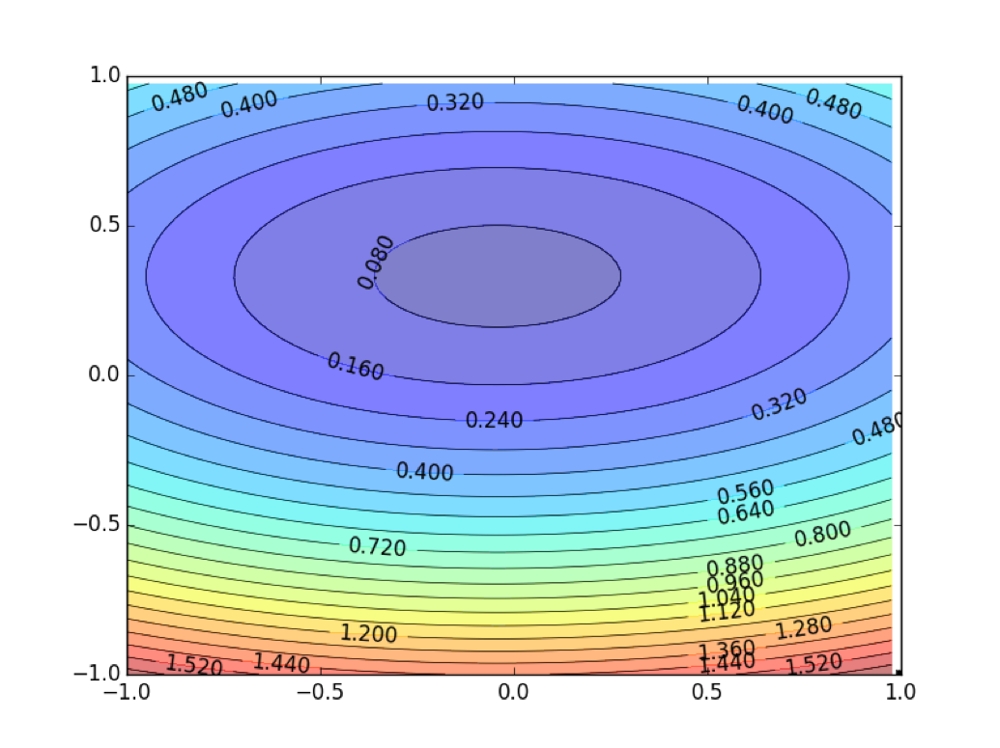
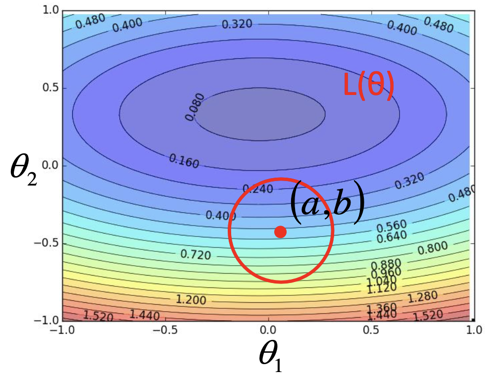

## 
Gradient descent

### 直观理解

一般的机器学习求参数的问题可以概括为：
$$
\theta^{*}=\arg \min _{\theta} L(\theta)
$$
假设$\theta$包含两个参数${\theta_1,\theta_2}$，对应的被优化函数$l(\theta)$的等高线图如下图所示：

根据泰勒展开式（单变量）：
$$
\begin{aligned} f(x) &=\sum_{n=0}^{\infty} \frac{f^{(n)}(a)}{n !}(x-a)^{n} \\ &=f(a)+f^{\prime}(a)(x-a)+\frac{f^{\prime \prime}(a)}{2 !}(x-a)^{2}+\frac{f^{\prime \prime \prime}(a)}{3 !}(x-a)^{3}+\cdots \end{aligned}
$$
当$x$趋近于$x_0$时，有$h(x) \approx h\left(x_{0}\right)+h^{\prime}\left(x_{0}\right)\left(x-x_{0}\right)$

对于多变量的展开式有：
$$
\begin{aligned} h(x, y) &=h\left(x_{0}, y_{0}\right)+\frac{\partial h\left(x_{0}, y_{0}\right)}{\partial x}\left(x-x_{0}\right)+\frac{\partial h\left(x_{0}, y_{0}\right)}{\partial y}\left(y-y_{0}\right) \\ &+\text { something related to }\left(x-x_{0}\right)^{2} \text { and }\left(y-y_{0}\right)^{2}+\ldots \ldots \end{aligned}
$$
当$x$和$y$趋近于$x_0$和$y_0$时，有：
$$
h(x, y) \approx h\left(x_{0}, y_{0}\right)+\frac{\partial h\left(x_{0}, y_{0}\right)}{\partial x}\left(x-x_{0}\right)+\frac{\partial h\left(x_{0}, y_{0}\right)}{\partial y}\left(y-y_{0}\right)
$$
因此对于下图，当红色圆圈足够小的时候，也就是对于周边无限接近于(a,b)的位置来说，有以下等式:

$$
\mathrm{L}(\theta) \approx \mathrm{L}(a, b)+\frac{\partial \mathrm{L}(a, b)}{\partial \theta_{1}}\left(\theta_{1}-a\right)+\frac{\partial \mathrm{L}(a, b)}{\partial \theta_{2}}\left(\theta_{2}-b\right)
$$
令
$$
\begin{array}{l}{s=\mathrm{L}(a, b)} \\ {u=\frac{\partial \mathrm{L}(a, b)}{\partial \theta_{1}}, v=\frac{\partial \mathrm{L}(a, b)}{\partial \theta_{2}}} \end{array}
$$
则有：
$$
{\mathrm{L}(\theta)}{\approx s+u\left(\theta_{1}-a\right)+v\left(\theta_{2}-b\right)}
$$
因此优化问题转化为在红色圆圈中最小化$L(\theta)$。令$(\theta_1-a)=\Delta \theta_{1}，(\theta_2-b)=\Delta \theta_2$，而对于在特定的圆圈中，$s$是常量，因此$L(\theta)$的值是由后面的部分来确定的。因此$L(\theta)$的大小可以看作是$(u,v)$和$(\Delta \theta_1,\Delta \theta_2)$的内积来决定的。根据线性代数的基础知识，两个向量的内积最小的时候是两个向量的方向相反的时候，因此可以推出梯度下降的原理。因此给定一个点，我们总能找到该点周边的最小值。但是如果**学习率**取得太大时，在图中也就是超出了红圈的返回，就不一定能找到最小值，这是因为此时的Taylor series不成立。

### 常见Gradient descent

### TIPS

- Tuning your learning rate

### 参考

[Taylor series](https://en.wikipedia.org/wiki/Taylor_series)

[李宏毅机器学习课件](http://speech.ee.ntu.edu.tw/~tlkagk/courses/ML_2017/Lecture/Gradient%20Descent.pdf)

