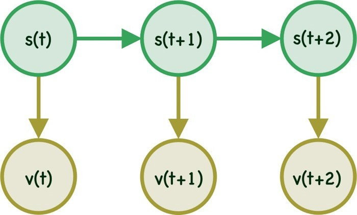
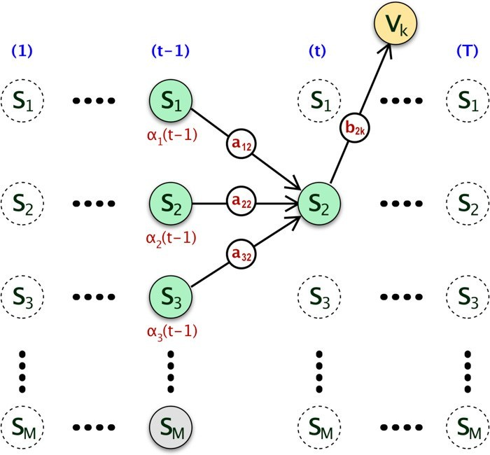
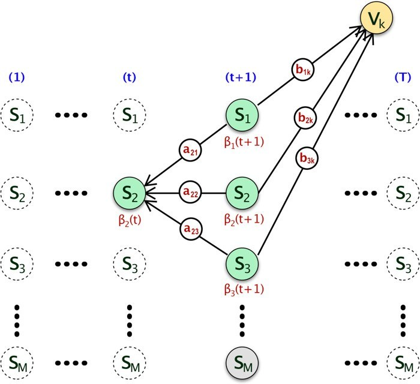

## 
HMM

### 随机过程

- 定义：对于每一个给定的$t_i\in T,i=1,2,\dots,X(t_i)$都是随机变量，则$X(t_i)$称作一个随机过程。或者说随机过程是依赖于时间的一族随机变量

- 解释：

  在自然界中的变化过程可以广义地分为两类。一类为确定性过程，另一类为不确定性过程或随机过程。

  何谓过程呢？通俗讲凡**和时间有关的变化**称为过程。

  如真空中的自由落体运动，有$X(t)=\frac{1}{2}gt^2$，这个函数关系确定了物体在任意时刻离开初点的精确位置，存在必然确定的因果关系，显然X与时间t有关，构成一个过程。这个过程我们把它称为确定性过程。

  另一类过程是没有确定的变化形式，没有必然的变化规律，如商店每天的营业额M，显然是一个不确定量即随机变量，进一步分析知该营业额M还和时间t有关，即M(t)，由此M构成一个过程，这里称这个过程为**随机过程**。

### 马尔可夫过程

**马尔可夫性质**是概率论中的一个概念。当一个随机过程在给定现在状态及所有过去状态情况下，其未来状态的条件概率分布仅依赖于当前状态；换句话说，在给定现在状态时，它与过去状态（即该过程的历史路径）是条件独立的，那么此随机过程即具有**马尔可夫性质**。具有马尔可夫性质的过程通常称之为**马尔可夫过程**。

### 马尔可夫模型

马尔可夫模型用于对随机改变系统(randomly change system)进行建模，也就是系统的状态是随机的类似天气预测这种系统。在马尔可夫模型中，系统的每个状态都是可见的。

状态在t时刻的状态s只与t-1时刻的状态有关称为一阶马尔可夫模型，同理，状态t时刻的状态s与t-1时刻和t-2时刻的状态有关称为二阶马尔可夫模型，以此类推。

#### 转移概率

模型中从一个状态转移到另一个状态的概率称为转移概率（Transition Probability）。若共有三个状态，则对应有9个转移概率。转移概率一般用 $a_{ij}$ 表示，表示在t+1时刻从状态i转移到状态j的概率。使用公式表示为
$$
a_{i j}=p(s(t+1)=j | s(t)=i)
$$

在马尔可夫模型中使用转移概率矩阵`（M*M）`来定义各个转移概率。对于有三个状态的情况，对应的转移概率矩阵为
$$
A=\left[\begin{array}{lll}{a_{11}} & {a_{12}} & {a_{13}} \\ {a_{21}} & {a_{22}} & {a_{23}} \\ {a_{31}} & {a_{32}} & {a_{33}}\end{array}\right]
$$
一个重要的性质为 $\sum_{j=1}^{M} a_{i j}=1 \quad \forall i$ ，在A中有$a_{11}+a_{12}+a_{13}=1$

#### 初始概率

马尔可夫模型的初始概率（t=0）表示为$\pi$ ，是一个M维的行向量，而行向量的每个维度的和要为1，即$\sum_{i=1}^{M}\pi_i=1 \quad \forall i$。

#### 总结

通过以上分析，MM主要由以下参数组成：

- A set of `M states`
- A `transition probability` matrix A
- An `initial probability` distribution π

### HMM

#### 介绍

HMM属于图模型的一种。

在HMM中顾名思义就是不同于MM，HMM的状态(`state`)是被隐藏（`Hidden`）的，称为隐状态。但是每一步 `t`  对应的状态`s(t)` 会对应一个可见的（observable/visible symbol）标志 `v(t)`。HMM的结构可以简单表示为

举一个简单的例子，假设一家赌场有两种不同种类的骰子一种是fair的另一种是unfair的，对于客人来说使用哪种骰子（fair or unfair）并不知道，只知道每次掷出的点数（between 1-6）。对于这种情况，骰子的状态则是`s`，而掷出的点数是`v`。

#### 发射概率(Emission Probability)

假设可观察变量只有两个状态${v_1,v_2}$，每个可观测变量一定是由隐状态发射出来的，每个状态发射到每个可观测变量的概率称为发射概率。记为$b_{jk}$，表示从隐状态j到可观测变量k的概率，即
$$
b_{j k}=p\left(v_{k}(t) | s_{j}(t)\right)
$$
同转移概率矩阵相同，发射概率同样对应发射概率矩阵，若有M个隐状态，C个可观察变量，则发射概率矩阵的形状为`M*C` 。发射概率具有的性质为
$$
\sum_{k=1}^{C} b_{j k}=1 \quad \forall j
$$

#### 三个基本问题

#### 评估问题（Evaluation）

- 问题定义

  首先定义模型（$\theta$）为：
  $$
  \theta \rarr s,v,a_{ij},b_{jk}
  $$
  给定模型$\theta$和观测变量（visible/observable symbol ）$V^T$，要求估算出可观测变量是由模型$\theta$产生的概率。

  因为也许会有很多的模型${\theta_1,\theta_2,\dots,\theta_n}$，需要求出$P(V^T|\theta_i)$，然后使用贝叶斯公式将$V^T$正确分类。对应的贝叶斯公式为：
  $$
  p\left(\theta | V^{T}\right)=\frac{p\left(V^{T} | \theta\right) p(\theta)}{p\left(V^{T}\right)}
  $$
  使用数学的方式可以将评估问题定义为：
  $$
  \begin{array}{c}{\text { Given } \theta, V_{T} \rightarrow \text { Estimate } p\left(V_{T} | \theta\right)} \\ {\quad \text { Where } \theta \rightarrow s, v, a_{i j}, b_{j k}}\end{array}
  $$
  

- 方法

  首先直观的想法是使用全概率公式。因为每一个可观测变量都是由隐状态发射来的，计算每一个可能的状态序列的概率以及该状态序列得到观测变量的概率，然后加和得到结果。数学化的表达为：
  $$
  \begin{aligned} p\left(V^{T} | \theta\right) &=\sum_{r=1}^{R} p\left(V^{T} | S_{r}^{T}\right) p\left(S_{r}^{T}\right) \\ \text { where } S_{r}^{T} &=\left\{s_{1}(1), s_{2}(2) \ldots s_{r}(T)\right\} \end{aligned}
  $$
  其中R表示可能的隐状态序列的最大数目。

  将上式进行展开有：
  $$
  \begin{aligned} p\left(V^{T} | \theta\right) &=\sum_{\text { All } \operatorname{Seq} \text { of } S} p\left(V^{T}, S^{T}\right) \\ &=\sum_{\text { All Seq of } S} p\left(V^{T} | S^{T}\right) p\left(S^{T}\right) \\ &=\sum_{r=1}^{R} \prod_{t=1}^{T} p(v(t) | s(t)) \prod_{t=1}^{T} p(s(t) | s(t-1)) \\ &=\sum_{r=1}^{R} \prod_{t=1}^{T} p(v(t) | s(t)) p(s(t) | s(t-1)) \end{aligned}
  $$
  

  上述方法易于理解，但是时间复杂度为$O(N^T\cdot T)$，存在着指数爆炸的问题，因此需要进行改进。改进的方法有前向算法（`Forward Algorithm`）和后向算法（`Backward Algorithm`）两种。

  - **前向算法（Forward Algorithm）**

    其实前向和后向算法都使用了动态规划的思想。将上一步的计算结果存储下来来避免重复计算。直观分析，t+1步有N个状态，而每个状态都可能由上一步的任意一个状态转移过来，全概率公式需要将t步的N个状态进行相加，因此t+1步需要进行$N^2$次运算。故时间复杂度为$O(N^2\cdot T)$ 。下面进行详细证明。

    首先定义$\alpha_{j}(t)=p(v(1)\dots v(t),s(t)=j)$，表示对于指定的可观察序列$V^T$ ，模型在t时刻状态为j的概率。

    **当t=1时：**
    $$
    \begin{aligned} \alpha_{j}(1) &=p\left(v_{k}(1), s(1)=j\right) \\ &=p\left(v_{k}(1) | s(1)=j\right) p(s(1)=j) \\ &=\pi_{j} p\left(v_{k}(1) | s(1)=j\right) \\ &=\pi_{j} b_{j k} \\ \text { where } \pi &=\text { initial distribution, } \\ b_{j k v(1)} &=\text { Emission Probability at } t=1 \end{aligned}
    $$
    

    其中$v_k(1)$表示的是在t=1的时候可观察变量为第k种。

    解释：上式中第一行到第二行使用了简单的联合概率与条件概率的关系。第二行中的后半部分可以由初始化变量得出也就是$\pi_j$，前半部分可以由发射概率得出。

    **当t=2时：**
    $$
    \begin{align} 
    \alpha_j(2) &= p \Big( v_k(1),v_k(2),s(2)= j \Big) \\ 
                       &= \color{Blue}{\sum_{i=1}^M} p \Big( v_k(1),v_k(2),\color{Blue}{s(1)= i}, s(2)= j \Big) \\ 
                       &=  \sum_{i=1}^M  p \Big( v_k(2) | s(2)= j, v_k(1),s(1)= i \Big) p \Big( v_k(1),s(2),s(1)= i \Big)\\ 
                       &=  \sum_{i=1}^M  p \Big( v_k(2) | s(2)= j, \color{Red}{v_k(1), s(1)= i} \Big) p \Big( s(2) | \color{Red}{v_k(1),}s(1)= i \Big) p \Big(v_k(1),s(1)= i \Big) \\ 
                       &=  \sum_{i=1}^M  p \Big( v_k(2) | s(2)= j  \Big) p \Big(s(2) | s(1)= i \Big) p \Big(v_k(1),s(1)= i \Big)\\ 
                       &=  \color{DarkRed}{p \Big( v_k(2) | s(2)= j \Big) }\sum_{i=1}^M p  \Big( s(2) | s(1)= i \Big) \color{Blue}{p  \Big( v_k(1),s(1)= i \Big)} \\ 
                       &=  \color{DarkRed}{b_{jk v(2)}}  \sum_{i=1}^M a_{i2} \color{Blue} {\alpha_i(1)}\\ 
    \text{where } a_{i2} &= \text{ Transition Probability } \\ 
    b_{jk v(2)} &= \text{ Emission Probability at } t=2 \\ 
    \alpha_i(1) &= \text{ Forward probability at } t=1 
    \end{align}
    $$
    解释：第一行中利用了一个小技巧即引入隐变量然后通过积分积掉来简化运算。第二行到第三行，第三行到第四行的转换即普通的联合概率和条件概率的转化。第四行到第五行中红色部分可以消去，因为HMM的性质，$v_k(2)$只与$s(2)$有关，$s(2)$只与$s(1)$有关。接下来的棕色部分与summation无关可以提出来，蓝色部分则是上面t=1的时候计算的结果。

    因此最终得出一般形式：
    $$
    \begin{align} 
    \alpha_j(t+1) &= p \Big( v_k(1) … v_k(t+1),s(t+1)= j \Big)  \\ 
                       &= \color{Blue}{\sum_{i=1}^M} p\Big(v_k(1) … v_k(t+1),\color{Blue}{s(t)= i}, s(t+1)= j \Big) \\ 
                       &=  \sum_{i=1}^M  p\Big(v_k(t+1) | s(t+1)= j, v_k(1) … v_k(t),s(t)= i\Big) \\ 
    	               & p\Big(v_k(1)…v_k(t),s(t+1),s(t)= i \Big) \\ 
                       &=  \sum_{i=1}^M  p\Big(v_k(t+1) | s(t+1)= j, \color{Red}{v_k(1)…v_k(t), s(t)= i}\Big) \\ 
    	               & p\Big(s(t+1) | \color{Red}{v_k(1)…v_k(t),}s(t)= i\Big) p\Big(v_k(t),s(t)= i\Big)\\ 
                       &=  \sum_{i=1}^M  p\Big(v_k(t+1) | s(t+1)= j\Big) p\Big(s(t+1) | s(t)= i\Big) p\Big(v_k(t),s(t)= i\Big)\\ 
                       &=  \color{DarkRed}{p\Big(v_k(t+1) | s(t+1)= j\Big) }\sum_{i=1}^M p\Big(s(t+1) | s(t)= i\Big) \color{Blue}{p\Big(v_k(t),s(t)= i\Big)} \\ 
                       &=  \color{DarkRed}{b_{jk v(t+1)}} \sum_{i=1}^M a_{ij} \color{Blue}{\alpha_i(t)} 
    \end{align}
    $$
    使用网格解释上述公式：

    

    假设在t-1时刻状态为s1的概率为$\alpha_1(t-1)$，其他的以此类推，则针对t-1时刻为s1，t时刻状态为s2的概率为$\alpha_1(t-1)\cdot a_{12}$，此时利用全概率公式求和即得出t时刻状态为s2的概率$\sum_{i=1}^{M} \alpha_{i}(t-1) a_{i 2}$。最后将所得到的概率与对应的发射概率相乘即得到所需的结果。因此最后的计算公式为：
    $$
    \alpha_{j}(t)=\left\{\begin{array}{ll}{\pi_{j} b_{j k}} & {\text { when } t=1} \\ {b_{j k} \sum_{i=1}^{M} \alpha_{i}(t-1) a_{i j}} & {\text { when } t \text { greater than } 1}\end{array}\right.
    $$
    这里的$\alpha_j(t)$表示的是经过发射之后的概率。

  - **后向算法（Backward Algorithm）**

    - 问题定义：

      后向算法与前向算法是`time-reversed`的，给定t之后的观测序列，计算t时刻状态为s的概率。
      $$
      \begin{align} 
      \beta_i(t) &= p \Big( v_k(t+1) …. v_k(T) | s(t) = i \Big) \\ 
      &= \sum_{j=0}^M p\Big(  v_k(t+1) …. v_k(T), s(t+1) = j | s(t) = i  \Big)        \\ 
      &= \sum_{j=0}^M p\Big(  v_k(t+2) …. v_k(T) |  v_k(t+1) , s(t+1) = j , s(t) = i  \Big) \\ 
      & p \Big( v_k(t+1) , s(t+1) = j | s(t) = i  \Big) \\ 
      &= \sum_{j=0}^M p\Big(  v_k(t+2) …. v_k(T) |  v_k(t+1) , s(t+1) = j , s(t) = i  \Big) 
      	\\ &	p \Big( v_k(t+1) |  s(t+1) = j , s(t) = i  \Big) p \Big( s(t+1) = j | s(t) = i  \Big) \\ 
      &= \sum_{j=0}^M  p\Big(  v_k(t+2) …. v_k(T) |  s(t+1) = j  \Big) p \Big( v_k(t+1) |  s(t+1) = j \Big)  \\ & p \Big( s(t+1) = j | s(t) = i  \Big) \\ 
      &= \sum_{j=0}^M \beta_j(t+1) b_{jkv(t+1)} a_{ij} \\ 
      \text{where } a_{i2} &= \text{ Transition Probability } \\ 
      b_{jk v(t+1)} &= \text{ Emission Probability at } t=t+1 \\ 
      \beta_i(t+1) &= \text{ Backward probability at } t=t+1 
      \end{align}
      $$
      

    - 理解：

    后向计算的网格理解如下图：

    

    其实这个的理解就是s1贡献的概率为$b_{1k}$，而$b_{1k}$由s2转化的概率为$a_{21}$。因此最后结果为：
    $$
    \beta_i(t)= \begin{cases} 
    1 & \text{ when }t = T \\ 
    \sum_{j=0}^M  a_{ij} b_{jkv(t+1)}\beta_j(t+1) & \text{ when } t \text{ less than } T 
    \end{cases}
    $$

#### 学习问题（Learning ）

#### 解码问题（Decoding）

- 问题定义

  给定观测序列$V^T$ 和模型$\theta \rarr \{A,B\}$ ，找出最合适的隐状态序列$S^T$。从名称理解，可观察序列就是隐藏序列经过编码得到的序列，因此解码问题就是将观测序列转化为隐状态序列的过程。

- 方法

  同评估问题相同，依旧可以计算每个隐状态序列对应的概率，但是时间复杂度为$O(N^T\cdot T)$，这一指数级的复杂度依旧可以优化，因此引出了维特比算法（Viterbi Algorithm）。

  - 

### 参考

[1.Introduction to Hidden Markov Model](http://www.adeveloperdiary.com/data-science/machine-learning/introduction-to-hidden-markov-model/)

