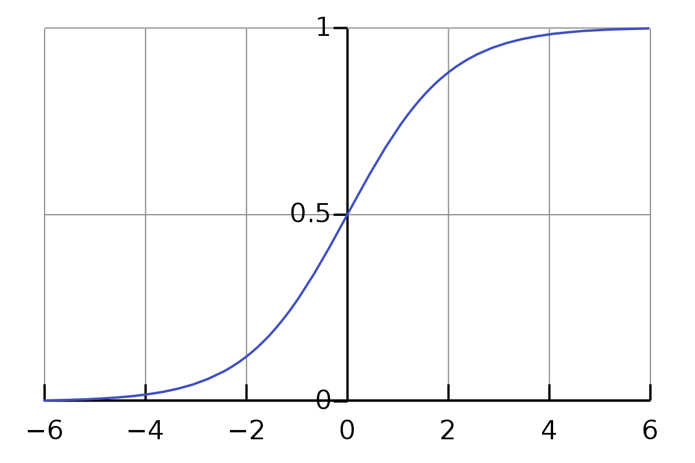
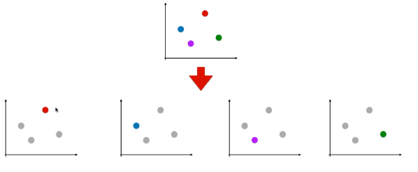
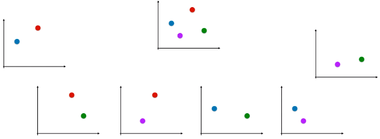

## 
Logistic Regression

逻辑回归（以下称为LR）是一种常用的**二分类**模型。同样可以通过一些其他的方法进行多分类预测。其实对于某些分类问题，使用线性回归+阈值的方法也解决，但是线性回归首先要拟合样本，这样训练出来的模型可能会受到离群点的影响，鲁棒性不够，对于LR模型，通常不需要拟合样本的分布，只需要确定决策边界即可。

### 目标函数

首先对于LR，要将输入（从负无穷到正无穷）的输出压缩到(0,1)，这一功能依靠sigmoid函数来实现。sigmoid函数为：
$$
S(t)=\frac{1}{1+e^{-t}}
$$
函数图像为:

除了可以将输入压缩到0到1之外，sigmoid函数还有一个很好的性质是当输入大于0的时候输出是大于0.5的，也就是样本判定的threshold。因此最终LR的function set为：
$$
\begin{array}{l}{P_{w, b}\left(C_{1} | x\right)=\sigma(z)} \\ {z=w \cdot x+b=\sum_{i} w_{i} x_{i}+b} \\ {\sigma(z)=\frac{1}{1+\exp (-z)}}\end{array}
$$
其中P下角标的w和b表示参数。

### 损失函数

假设训练数据为：

| X1   | X2   | X3   | ...  | XN   |
| ---- | ---- | ---- | ---- | ---- |
| C1   | C1   | C2   | ...  | C1   |

则我们要使得
$$
L(w, b)=f_{w, b}\left(x^{1}\right) f_{w, b}\left(x^{2}\right)\left(1-f_{w, b}\left(x^{3}\right)\right) \cdots f_{w, b}\left(x^{N}\right)
$$
最大，即损失函数为：
$$
w^{*}, b^{*}=\arg \max _{w, b} L(w, b)
$$
即：
$$
w^{*}, b^{*}=\arg \min _{w, b} -lnL(w, b)
$$
要进行参数的调优必须要将argmin的形式转化为一个可优化的函数，因此规定属于C1的$\hat{y}=1$，其余的为0，因此上表要写作

| X1   | X2   | X3   | ...  | XN   |
| ---- | ---- | ---- | ---- | ---- |
| 1    | 1    | 0    |      | 1    |

因此最终的损失函数为
$$
\sum_{n}-\left[\hat{y}^{n} \ln f_{w, b}\left(x^{n}\right)+\left(1-\hat{y}^{n}\right) \ln \left(1-f_{w, b}\left(x^{n}\right)\right)\right]
$$
可以看作是两个Bernoulli分布的交叉熵。

Distribution p：
$$
\begin{array}{l}{p(x=1)=\hat{y}^{n}} \\ {p(x=0)=1-\hat{y}^{n}}\end{array}
$$

Distribution q：
$$
\begin{array}{l}{q(x=1)=f\left(x^{n}\right)} \\ {q(x=0)=1-f\left(x^{n}\right)}\end{array}
$$
最后则是优化通过梯度下降等方法进行参数的优化。最终梯度下降的结果为：
$$
w_{i} \leftarrow w_{i}-\eta \sum_{n}-\left(\hat{y}^{n}-f_{w, b}\left(x^{n}\right)\right) x_{i}^{n}
$$

### 二分类到多分类

- OvR(One vs Rest)

  n 种类型的样本进行分类时，**分别**取一种样本作为一类，将剩余的所有类型的样本看做另一类，这样就形成了 **n 个**二分类问题，使用逻辑回归算法对 n 个数据集训练出 n 个模型，将待预测的样本传入这 n 个模型中，所得概率最高的那个模型对应的样本类型即认为是该预测样本的类型。

  

  上图中假设有4种类型的样本，因此训练出四个对应的分类器，使用四个分类器分别计算给定测试数据的概率，取最大的值作为预测结果。

- OvO(One vs One)

  n 类样本中，每次挑出 2 种类型，两两结合，一共有 $C_n^2$ 种二分类情况，使用 $C_n^2$ 种模型预测样本类型，有 Cn2 个预测结果，种类最多的那种样本类型，就认为是该样本最终的预测类型。

  

  

### 参考

[1.LR](http://speech.ee.ntu.edu.tw/~tlkagk/courses/ML_2017/Lecture/Logistic%20Regression%20(v4).pdf)

[2.OvO VS OvR](https://www.cnblogs.com/volcao/p/9389921.html)